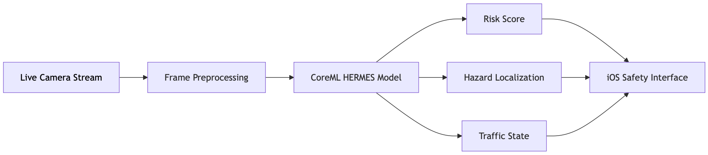

<h1 class="hero-title">HERMES</h1>

Real-Time Traffic Hazard Reasoning on Edge Devices

  iOS / CoreML
  NVIDIA Jetson Orin Nano
  CUDA / TensorRT
  RWKV Video Model
  Real-Time Edge AI

<strong>HERMES: Hierarchical Efficient RWKV with Multi-rate Event Sensing</strong>

HERMES is a research-to-production project for real-time, causal traffic hazard anticipation using a CUDA/CoreML-optimized RWKV video model.

The system performs frame-by-frame online inference directly from video streams and predicts traffic risk without using future frames. HERMES is deployed on <strong>iPhone via CoreML</strong> and on <strong>NVIDIA Jetson Orin Nano via CUDA/TensorRT</strong>, and validated in real-world motorcycle riding scenarios.

  

<h3> Real-World iOS Deployment </h3>

HERMES was integrated into a real-time iOS prototype for motorcycle-mounted traffic hazard anticipation.

The app processes a live camera stream directly on device and visualizes predicted traffic risk through a lightweight safety dashboard.

  
Causal frame-by-frame inference

  
Live traffic risk estimation

  
SAFE / WARNING / DANGER state prediction

  
Frame-level hazard probability

  
Current riding speed

  
Visual hazard localization cues

  
Sound and vibration warning options

  
Runtime controls for camera, resolution, inference frequency, focus, and exposure

The system was tested in real-world urban riding scenarios, including rainy roads, nighttime traffic, dense scooter flows, intersections, and mixed vehicle environments.

## Demo Gallery

The following demos show HERMES running in real time on iPhone during motorcycle-mounted riding in real-world urban traffic.

GIFs may take several seconds to load depending on network speed. Each demo is sampled from real riding footage.

  
  

    
Demo 1 — Dense Urban Warning

    
Real-time WARNING prediction in dense scooter traffic.

  

  
  

    
Demo 2 — Nighttime Following

    
Stable SAFE prediction during low-light riding.

  

  
  

    
Demo 3 — Nighttime Intersection Zone

    
Risk estimation near complex intersection markings.

  

  
  

    
Demo 4 — Multi-Lane Night Traffic

    
Online inference during normal nighttime traffic.

  

  
  

    
Demo 5 — Rainy Scooter Traffic

    
Robust prediction under wet-road reflections.

  

  
  

    
Demo 6 — Rainy Urban Corridor

    
Real-world rainy traffic with storefront clutter.

  

  
  

    
Demo 7 — Close-Range Scooter Interaction

    
Localization of nearby traffic participants.

  

  
  

    
Demo 8 — Rainy Intersection Approach

    
Risk estimation while approaching an intersection.

  

  
  

    
Demo 9 — Crowded Scooter Queue

    
Stable prediction in dense slow-moving traffic.

  

  
  

    
Demo 10 — Higher-Speed Urban Road

    
Safety monitoring with surrounding vehicles at speed.

  

<h3>iOS App Interface</h3>

  

The HERMES iOS interface is designed for real-time riding feedback while keeping the road view unobstructed.

<table class="clean-table">
  <tr>
    <th>Component</th>
    <th>Description</th>
  </tr>
  <tr>
    <td>Safety Status Panel</td>
    <td>Shows the current prediction state, real-time hazard probability, and riding speed.</td>
  </tr>
  <tr>
    <td>Live Camera Inference</td>
    <td>Processes the iPhone camera stream directly on device using causal frame-by-frame inference.</td>
  </tr>
  <tr>
    <td>Hazard Localization Cues</td>
    <td>Visualizes image regions that contribute to the predicted traffic risk.</td>
  </tr>
  <tr>
    <td>Runtime Control Panel</td>
    <td>Controls camera lens, resolution, inference frequency, warning alerts, focus, and exposure.</td>
  </tr>
  <tr>
    <td>Compact Peripheral Indicator</td>
    <td>Provides quick visual safety feedback without covering the central road view.</td>
  </tr>
  <tr>
    <td>Adaptive Inference Settings</td>
    <td>Allows balancing responsiveness, accuracy, thermal behavior, and battery consumption.</td>
  </tr>
  <tr>
    <td>Settings Toggle</td>
    <td>Opens the overlay control panel while keeping the live camera feed visible.</td>
  </tr>
</table>

<h3> System Pipeline </h3>

  

<h3> Highlights </h3>

  
Real-time online inference under strict causal constraints

  
No future frames used during inference

  
CoreML-optimized deployment on iPhone

  
CUDA/TensorRT deployment on NVIDIA Jetson Orin Nano

  
Motorcycle-mounted real-world testing

  
RWKV-based temporal modeling with linear complexity

  
Multi-task prediction of traffic anomaly occurrence, localization, and category

  
Edge-oriented model design with 31M parameters

<h3> Method Overview </h3>

HERMES uses a <b>Hierarchical Spatio-Temporal RWKV** backbone for efficient causal video understanding.

<h4> HST-RWKV Backbone </h4>

The backbone combines hierarchical spatial encoding with recurrent temporal modeling, enabling online video understanding without requiring access to the full video sequence.

<h4> Multi-rate Event Sensing </h4>

Stride-controlled recurrent updates capture both fast motion cues and longer-range temporal context within a single recurrent architecture.

 

<h4> Causal Future Distillation </h4>

Causal Future Distillation transfers future-aware representation targets during training while preserving strictly causal inference at test time.

<h4> Unified Multi-task Objective </h4>

HERMES jointly predicts traffic anomaly occurrence, hazard localization, and anomaly category from the same causal video representation.

<h3> Deployment </h3>

<table class="clean-table">
  <tr>
    <th>Platform</th>
    <th>Runtime</th>
    <th>Status</th>
  </tr>
  <tr>
    <td>iPhone</td>
    <td>CoreML</td>
    <td>Real-time prototype implemented</td>
  </tr>
  <tr>
    <td>NVIDIA Jetson Orin Nano</td>
    <td>CUDA / TensorRT</td>
    <td>Edge deployment tested</td>
  </tr>
</table>

<h3> Status </h3>

Current status:

<ul class="status-list">
  <li>iOS prototype implemented</li>
  <li>CoreML model deployed on iPhone</li>
  <li>Real-time motorcycle-mounted testing completed</li>
  <li>NVIDIA Jetson Orin Nano deployment tested</li>
  <li>Demo videos collected from real-world riding footage</li>
  <li>Paper currently under review</li>
</ul>

<h3> Contact </h3>

<b>Patrik Patera, Ph.D.</b>

<i>Computer Vision & Deep Learning Research Egnineer</i>

Taiwan

pat.patera@gmail.com

