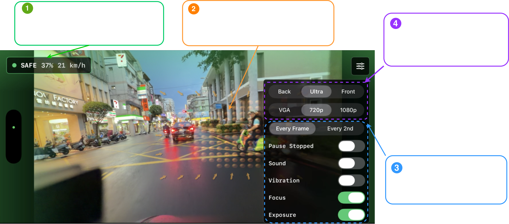
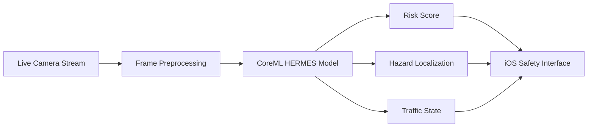

  

# Real-Time Traffic Hazard Reasoning on Edge Devices (iOS / Nvidia Jetson)

**HERMES: Hierarchical Efficient RWKV with Multi-rate Event Sensing**

HERMES is a research-to-production project for real-time, causal traffic hazard anticipation using a CUDA/CoreML-optimized RWKV video model.

The system performs frame-by-frame online inference directly from video streams and predicts traffic risk without using future frames. HERMES is deployed on **iPhone via CoreML** and on **NVIDIA Jetson Orin Nano via CUDA/TensorRT**, and validated in real-world motorcycle riding scenarios.

---

## Real-World iOS Deployment

HERMES was integrated into a real-time iOS prototype for motorcycle-mounted traffic hazard anticipation.

The app processes a live camera stream directly on device and visualizes predicted traffic risk through a lightweight safety dashboard.

The prototype provides:

- **Causal frame-by-frame inference**
- **Live traffic risk estimation**
- **SAFE / WARNING / DANGER state prediction**
- **Frame-level hazard probability**
- **Current riding speed**
- **Visual hazard localization cues**
- **Sound and vibration warning options**
- **Runtime controls for camera mode, resolution, inference frequency, focus, and exposure**

The system was tested in real-world urban riding scenarios, including rainy roads, nighttime traffic, dense scooter flows, intersections, and mixed vehicle environments.

---

## Demo Gallery

The following demos show HERMES running in real time on iPhone during motorcycle-mounted riding in real-world urban traffic.

> GIFs may take several seconds to load depending on network speed. Each demo is sampled from real riding footage.

<table>
  <tr>
    <td width="50%">
      
       
      <strong>Demo 1 — Dense Urban Warning</strong>
       
      Real-time WARNING prediction in dense scooter traffic.
    </td>
    <td width="50%">
      
       
      <strong>Demo 2 — Nighttime Following</strong>
       
      Stable SAFE prediction during low-light riding.
    </td>
  </tr>
  <tr>
    <td width="50%">
      
       
      <strong>Demo 3 — Nighttime Intersection Zone</strong>
       
      Risk estimation near complex intersection markings.
    </td>
    <td width="50%">
      
       
      <strong>Demo 4 — Multi-Lane Night Traffic</strong>
       
      Online inference during normal nighttime traffic.
    </td>
  </tr>
  <tr>
    <td width="50%">
      
       
      <strong>Demo 5 — Rainy Scooter Traffic</strong>
       
      Robust prediction under wet-road reflections.
    </td>
    <td width="50%">
      
       
      <strong>Demo 6 — Rainy Urban Corridor</strong>
       
      Real-world rainy traffic with storefront clutter.
    </td>
  </tr>
  <tr>
    <td width="50%">
      
       
      <strong>Demo 7 — Close-Range Scooter Interaction</strong>
       
      Localization of nearby traffic participants.
    </td>
    <td width="50%">
      
       
      <strong>Demo 8 — Rainy Intersection Approach</strong>
       
      Risk estimation while approaching an intersection.
    </td>
  </tr>
  <tr>
    <td width="50%">
      
       
      <strong>Demo 9 — Crowded Scooter Queue</strong>
       
      Stable prediction in dense slow-moving traffic.
    </td>
    <td width="50%">
      
       
      <strong>Demo 10 — Higher-Speed Urban Road</strong>
       
      Safety monitoring with surrounding vehicles at speed.
    </td>
  </tr>
</table>

---

## iOS App Interface

  

The HERMES iOS interface is designed for real-time riding feedback while keeping the road view unobstructed.

| Component | Description |
|---|---|
| **Safety Status Panel** | Shows the current prediction state, real-time hazard probability, and riding speed. |
| **Live Camera Inference** | Processes the iPhone camera stream directly on device using causal frame-by-frame inference. |
| **Hazard Localization Cues** | Visualizes image regions that contribute to the predicted traffic risk. |
| **Runtime Control Panel** | Controls camera lens, resolution, inference frequency, warning alerts, focus, and exposure. |
| **Compact Peripheral Indicator** | Provides quick visual safety feedback without covering the central road view. |
| **Adaptive Inference Settings** | Allows balancing responsiveness, accuracy, thermal behavior, and battery consumption. |
| **Settings Toggle** | Opens the overlay control panel while keeping the live camera feed visible. |

---

## System Pipeline

---

## Highlights

- **Real-time online inference** under strict causal constraints
- **No future frames used during inference**
- **CoreML-optimized deployment on iPhone**
- **CUDA/TensorRT deployment on NVIDIA Jetson Orin Nano**
- **Motorcycle-mounted real-world testing**
- **RWKV-based temporal modeling** with linear complexity
- **Multi-task prediction** of traffic anomaly occurrence, localization, and category
- **Edge-oriented model design** with 31M parameters

---

## Method Overview

HERMES uses a **Hierarchical Spatio-Temporal RWKV** backbone for efficient causal video understanding.

### HST-RWKV Backbone

The backbone combines hierarchical spatial encoding with recurrent temporal modeling, enabling online video understanding without requiring access to the full video sequence.

### Multi-rate Event Sensing

Stride-controlled recurrent updates capture both fast motion cues and longer-range temporal context within a single recurrent architecture.

### Causal Future Distillation

Causal Future Distillation transfers future-aware representation targets during training while preserving strictly causal inference at test time.

### Unified Multi-task Objective

HERMES jointly predicts traffic anomaly occurrence, hazard localization, and anomaly category from the same causal video representation.

---

## Deployment

| Platform | Runtime | Status |
|---|---|---|
| iPhone | CoreML | Real-time prototype implemented |
| NVIDIA Jetson Orin Nano | CUDA / TensorRT | Edge deployment tested |

---

## Status

Current status:

- iOS prototype implemented
- CoreML model deployed on iPhone
- Real-time motorcycle-mounted testing completed
- NVIDIA Jetson Orin Nano deployment tested
- Demo videos collected from real-world riding footage
- Paper currently under review

---

## Contact

**Patrik Patera**  
Ph.D. Candidate, Computer Vision & Deep Learning  
Taiwan Tech
